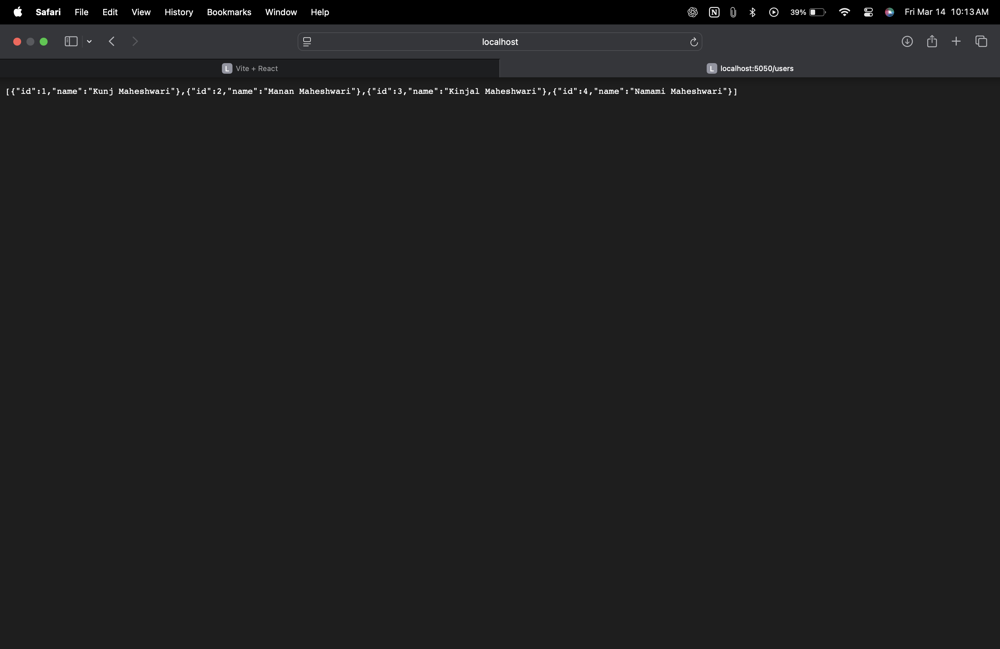
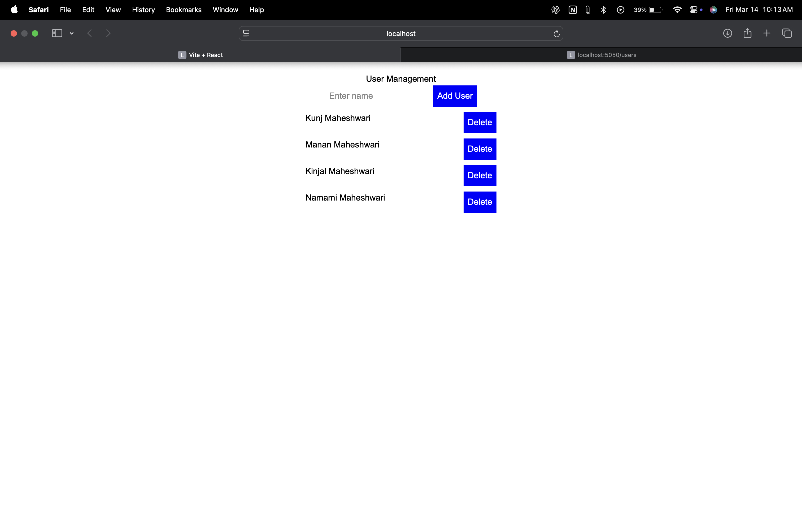

# Project Documentation

## 📌 Project Overview
This is a simple full-stack application using **Node.js, Express.js, and React.js** that allows users to be added and displayed. It includes **strict coding standards, automated testing, and a CI/CD pipeline**.

## 🚀 Tech Stack
- **Backend**: Node.js, Express.js
- **Frontend**: React.js
- **Database**: In-memory (no DB required)
- **Testing**: Jest (Unit), Cypress (E2E)
- **CI/CD**: GitHub Actions
- **Linting & Formatting**: ESLint, Prettier

## 📂 Folder Structure
```
/backend
  ├── /src
  │   ├── server.js          # Main Express server
  │   ├── app.js             # Express app setup
  │   ├── /routes
  │   │   ├── userRoutes.js  # Routes for users API
  │   ├── /controllers
  │   │   ├── userController.js  # Logic for user handling
  │   ├── /tests
  │   │   ├── user.test.js   # Jest unit tests
  ├── package.json           # Backend dependencies
/frontend
  ├── /src
  │   ├── App.js             # Main React component
  │   ├── /components
  │   │   ├── UserList.js    # Displays users
  │   │   ├── AddUser.js     # Adds users
  ├── package.json           # Frontend dependencies
  ├── cypress.config.js      # Cypress test config
```

## 📥 Installation & Setup
### Backend Setup
1. Navigate to the backend folder:
   ```sh
   cd backend
   ```
2. Install dependencies:
   ```sh
   npm install
   ```
3. Start the server:
   ```sh
   npm start
   ```


### Frontend Setup
1. Navigate to the frontend folder:
   ```sh
   cd frontend
   ```
2. Install dependencies:
   ```sh
   npm install
   ```
3. Start the frontend:
   ```sh
   npm start
   ```


## 📡 API Documentation (Postman)
Postman is used for API testing and documentation. Follow these steps:

### 1️⃣ Install Postman
Download and install [Postman](https://www.postman.com/downloads/).

### 2️⃣ API Endpoints
Use the following endpoints in Postman:
- **Get all users** → `GET http://localhost:5050/users`
- **Add a new user** → `POST http://localhost:5050/users`
  - Body (JSON): `{ "name": "Kunj Maheshwari" }`
- **Delete a user** → `DELETE http://localhost:5050/users/:id`

### 3️⃣ Save and Export Postman Collection
1. Open **Postman**
2. Create a new **Collection** and save API requests
3. Click **Export Collection**
4. Share the `.json` file for import by others

### Screenshots


## ✅ Testing
Run **unit tests** with Jest:
```sh
npm test
```
Run **end-to-end tests** with Cypress:
```sh
npx cypress open
```

## 🛠️ CI/CD Pipeline
The GitHub Actions workflow automatically:
- Runs ESLint & Prettier
- Executes Jest unit tests
- Performs Cypress E2E tests

Check `.github/workflows/ci.yml` for pipeline details.

## 🔗 Conclusion
The project is now **fully documented**, **tested**, and **CI/CD integrated**! 🚀